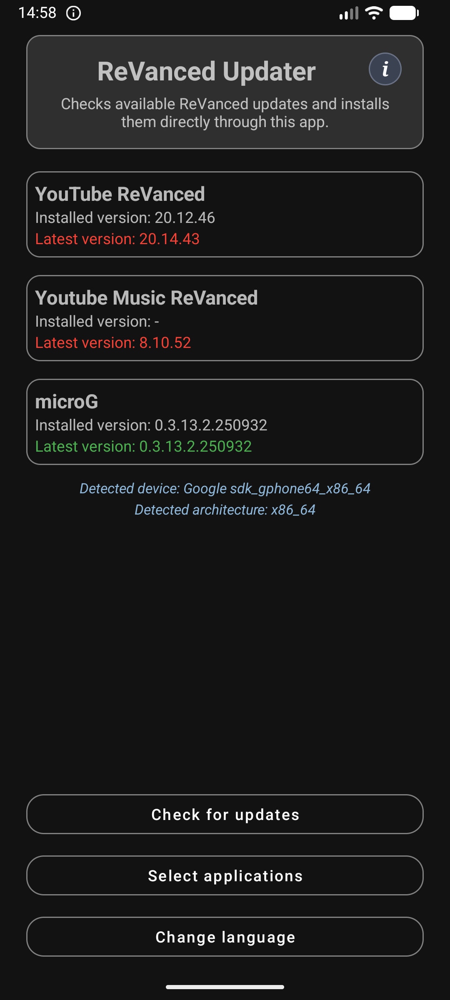
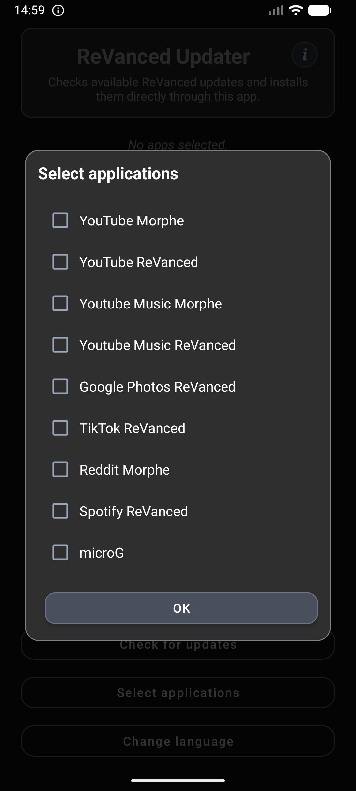
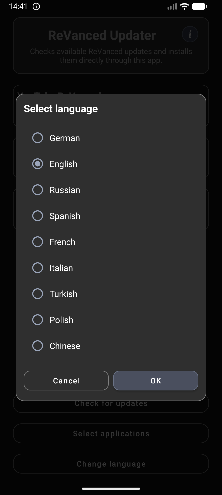
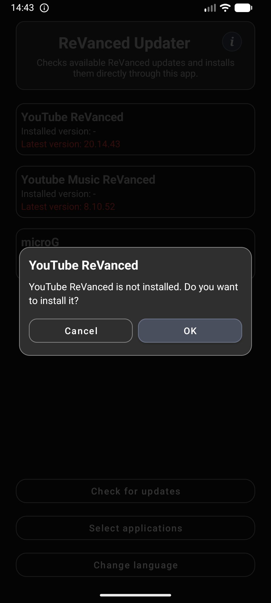
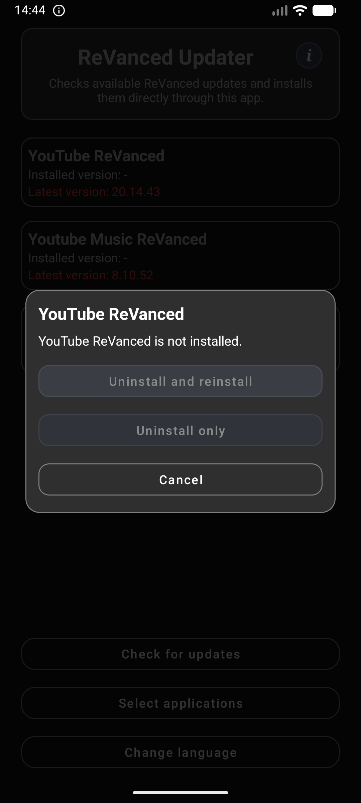
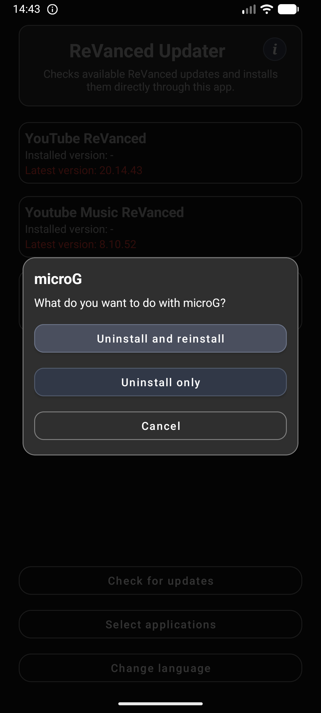
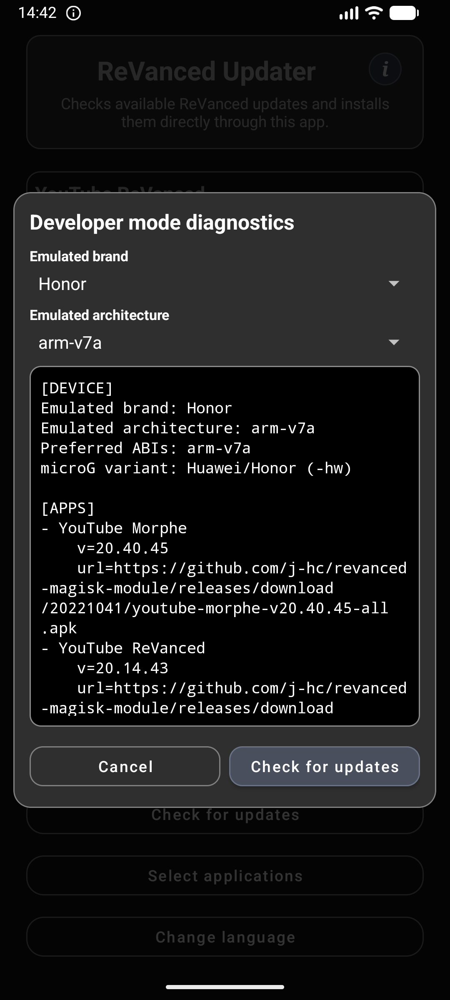
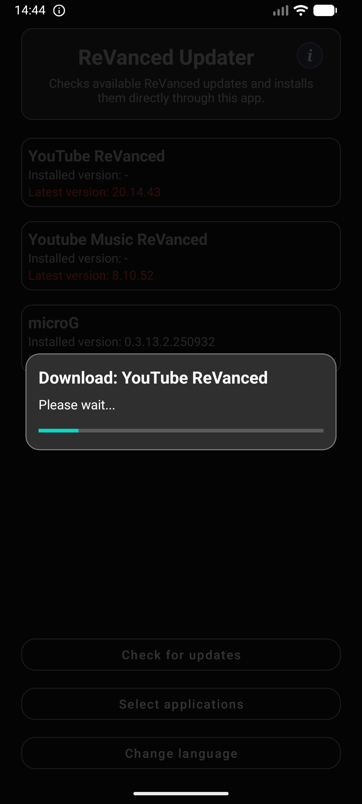
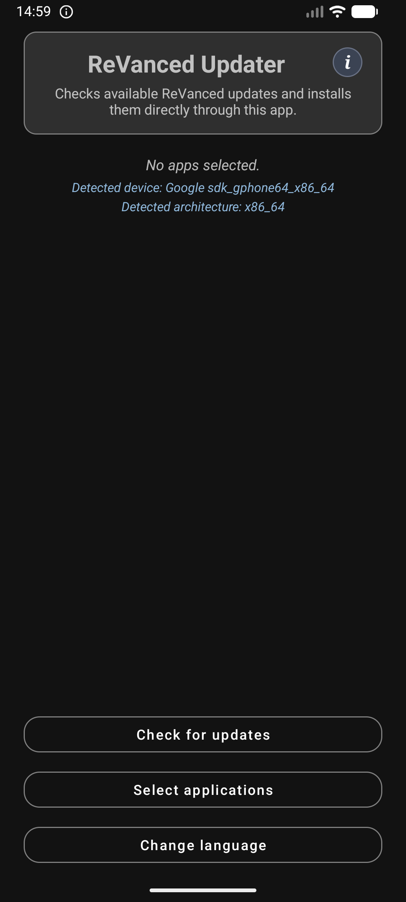

* * *

📲 ReVanced Updater
============================

**An Android app to check, download, and install the latest ReVanced updates**  
⚡📥📱🌍✅

   

   
Get release updates on Telegram. If you want to support more apps, you can leave a small donation for a coffee.

* * *

✨ Authors
---------

| Name | GitHub | Role | Contact | Contributions |
| --- | --- | --- | --- | --- |
| **[Darexsh by Daniel Sichler](https://github.com/Darexsh)** | [Link](https://github.com/Darexsh?tab=repositories) | Android App Development 📱🛠️, UI/UX Design 🎨 | 📧 [E-Mail](mailto:sichler.daniel@gmail.com) | Concept, Update Checking & Download Logic, Multi-language Support, UI Design |

* * *

🚀 About the Project
===================

**ReVanced Updater** is an Android application designed to help users easily check for updates and install the latest versions of ReVanced and Morphe apps, including YouTube ReVanced, YouTube Music ReVanced, Google Photos ReVanced, TikTok ReVanced, Spotify ReVanced, YouTube Morphe, YouTube Music Morphe, Reddit Morphe, and microG. The app provides a simple interface, multi-language support, architecture-aware APK selection, and automated APK downloads.

* * *

✨ Features
----------

* 🔄 **Check for updates**: Quickly see the installed and latest version of supported ReVanced apps.
    
* 🌐 **Multi-language support**: Available in German, English, Russian, Spanish, French, Italian, Turkish, Polish, and Chinese.
    
* ✅ **App selection**: Choose which apps to display and manage.

* 🧭 **First launch setup**: On first start, an app-selection dialog appears so you can choose what to manage.
    
* 📥 **Download & install APKs**: Automatically download APK files and guide you through installation.

* 🧠 **Architecture-aware matching**: Automatically selects compatible APK variants (for example `arm64-v8a` / `arm-v7a`) where available.
    
* 📱 **Device info in UI**: Shows detected device and architecture directly in the main screen.

* 🗑️ **Manage old APKs**: Detect and optionally delete outdated APK files.
    
* 🎨 **Color-coded version status**: Green indicates the app is up-to-date, red indicates an update is available.

* ℹ️ **In-app info dialog**: Header info button (`i`) opens app details and contact/social links.

* 🧰 **Improved selection dialogs**: Custom app/language dialogs with styled controls.

* 🌙 **Forced dark mode**: App is displayed in dark mode for consistent visuals.

* 🈳 **Empty-state hint**: Shows a message when no apps are selected.

* 💾 **State caching during session**: Checked update state is preserved across list refreshes (for example after APK cleanup).

* 🧼 **Custom fancy popups**: Dialogs across the app use a unified custom rounded style (selection, language, app actions, status/info, confirmations, and download progress).

* 🗑️ **Long-press app actions**: Long-press an installed app card to uninstall only or uninstall and reinstall.

* 🛠️ **Developer mode (header long-press)**: Long-press the header box to open a dedicated developer popup with terminal-style diagnostics for all apps (version + full URL), run update checks directly from that popup, and emulate brand/architecture profiles (Auto/Samsung/Honor/Huawei/Google + Auto/arm64-v8a/arm-v7a).
    

* * *

📱 Supported Apps
-----------------

| App Name | Package Name | Download Source |
| --- | --- | --- |
| YouTube Morphe | `app.morphe.android.youtube` | [j-hc/revanced-magisk-module](https://github.com/j-hc/revanced-magisk-module/releases) |
| YouTube ReVanced | `app.revanced.android.youtube` | [j-hc/revanced-magisk-module](https://github.com/j-hc/revanced-magisk-module/releases) |
| YouTube Music Morphe | `app.morphe.android.apps.youtube.music` | [j-hc/revanced-magisk-module](https://github.com/j-hc/revanced-magisk-module/releases) |
| YouTube Music ReVanced | `app.revanced.android.apps.youtube.music` | [j-hc/revanced-magisk-module](https://github.com/j-hc/revanced-magisk-module/releases) |
| Google Photos ReVanced | `app.revanced.android.photos` | [j-hc/revanced-magisk-module](https://github.com/j-hc/revanced-magisk-module/releases) |
| TikTok ReVanced | `com.zhiliaoapp.musically` | [j-hc/revanced-magisk-module](https://github.com/j-hc/revanced-magisk-module/releases) |
| Spotify ReVanced | `com.spotify.music` | [j-hc/revanced-magisk-module](https://github.com/j-hc/revanced-magisk-module/releases) |
| Reddit Morphe | `com.reddit.frontpage` | [j-hc/revanced-magisk-module](https://github.com/j-hc/revanced-magisk-module/releases) |
| microG | `app.revanced.android.gms` | [ReVanced/GmsCore](https://github.com/ReVanced/GmsCore) |

* * *

📥 Installation
---------------

1. Download the latest APK for the ReVanced Updater from the official repository or release page.
    
2. 🔒 Enable installation from unknown sources if prompted (required on Android 8.0+).
    
3. 📂 On first launch, choose which ReVanced apps you want to manage.
    
4. 🔍 Tap **Check Updates** to see the latest available versions.
    
5. ⬆️ Tap on an app to update or install it.
    

* * *

📝 Usage
--------

1. 🔍 **Check Updates**: Displays installed versions and fetches the newest versions from GitHub.
    
2. ✅ **Select Apps**: Choose which ReVanced apps you want to display in the main interface.
    
3. 🌐 **Change Language**: Switch between supported languages using the **Change Language** button.
    
4. ℹ️ **App Info**: Tap the header **i** button for app information and quick links.

5. ⬆️ **Install Updates**: Tap an app box to see update status and start the APK installation if a new version is available.

6. 🗑️ **App Actions**: Long-press an installed app card to open uninstall / reinstall actions.
    
7. 🛠️ **Developer Mode**: Long-press the header box to open diagnostics, emulate brand/architecture, and run **Check Updates** for all apps from inside the popup.

Developer Mode details:

1. Long-press the header box to open the developer popup.
2. Use **Emulated brand** and **Emulated architecture** to test variant selection behavior.
3. Tap **Check updates** in the popup to fetch data for all configured apps (including hidden/unselected apps).
4. Read terminal-style diagnostics with per-app version and full download URL output.

The app automatically handles downloading APK files and launching the installer once the download completes.

* * *

📸 Screenshots
--------------

<table>
  <tr>
    <td align="center"><b>Main Screen</b> </td>
    <td align="center"><b>First Launch</b> </td>
    <td align="center"><b>Change Language</b> </td>
  </tr>
  <tr>
    <td align="center"><b>Installation Prompt</b> </td>
    <td align="center"><b>Long Press (Not Installed)</b> </td>
    <td align="center"><b>Uninstall &amp; Reinstall</b> </td>
  </tr>
  <tr>
    <td align="center"><b>Developer Mode</b> </td>
    <td align="center"><b>Download Progress</b> </td>
    <td align="center"><b>No Apps Selected</b> </td>
  </tr>
</table>

* * *

🔑 Permissions
--------------

* 🌐 **Internet**: Required to fetch the latest release information from GitHub.
    
* 💾 **Storage**: Required to save downloaded APK files temporarily.
    
* 🔓 **Install Unknown Apps**: Required to install APKs from the app.

* 🗑️ **Request Delete Packages**: Required to trigger Android’s uninstall flow from long-press app actions.
    

* * *

🧰 Troubleshooting
-----------------

* **GitHub rate limit**: If update checks fail with a rate-limit message, wait and retry later.
* **APK install blocked**: On Android 8.0+, allow install from unknown sources for this app in system settings.
* **Uninstall action not starting**: Make sure you installed the latest updater build (manifest permission changes require reinstall/update).

* * *

⚙️ Technical Details
--------------------

* 📦 Uses GitHub API to fetch the latest releases for supported apps.
    
* 🤖 Supports Android 5.0 (Lollipop) and above (`minSdk 21`).
    
* 💾 Uses `SharedPreferences` to store selected apps, language settings, and first-launch setup state.
    
* 🌍 Automatically handles multiple languages and locale changes at runtime.
    
* 📊 Provides progress bars for APK downloads and error handling with alerts, including HTTP/network feedback.

* 🧩 Uses architecture-aware asset selection for variant-based APK releases.

* 📦 microG selection is device-aware and prefers Huawei/Honor (`-hw`) builds on matching devices with fallback handling.

* 🎯 App package visibility is explicitly declared via Android `<queries>` for installed-version detection.

* 🎨 Uses shared custom dialog components for app selection, language selection, and long-press app actions.

* 🛠️ Developer mode supports brand/architecture emulation and checks updates for all configured apps, including hidden/unselected ones.
    

* * *

🧭 Scope
--------

* APK-focused only: This app is designed for APK update checking/downloading/installing flows.
* No Magisk module management: Root/Magisk workflows are intentionally out of scope.

* * *

📜 License
----------

This project is licensed under the **Non-Commercial Software License (MIT-style) v1.0** and was developed as an educational project. You are free to use, modify, and distribute the code for **non-commercial purposes only**, and must credit the author:

**Copyright (c) 2025 Darexsh by Daniel Sichler**

Please include the following notice with any use or distribution:

> Developed by Daniel Sichler aka Darexsh. Licensed under the Non-Commercial Software License (MIT-style) v1.0. See `LICENSE` for details.

The full license is available in the [LICENSE](LICENSE) file.

* * *

 Created with ❤️ by Daniel Sichler 

